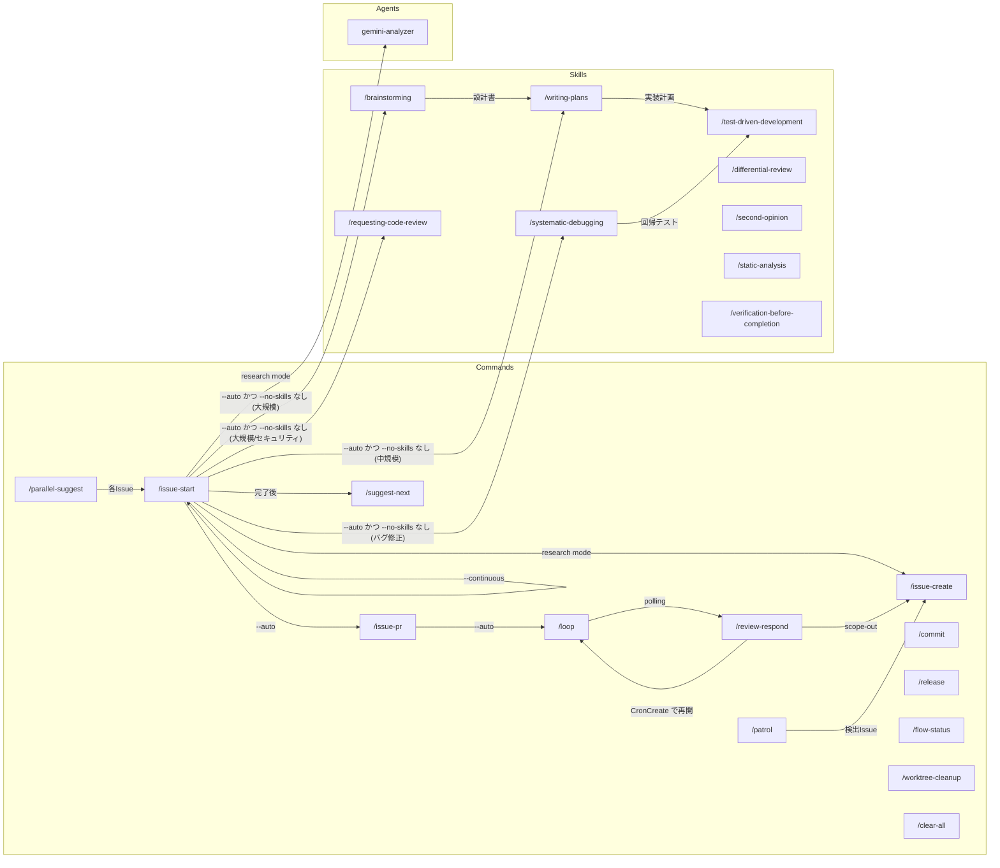
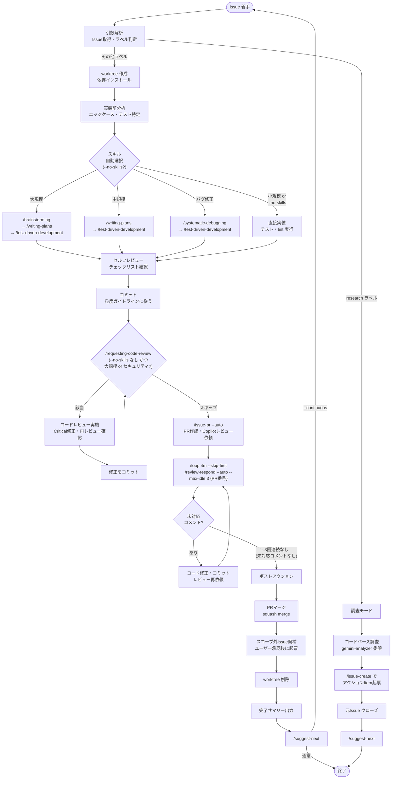
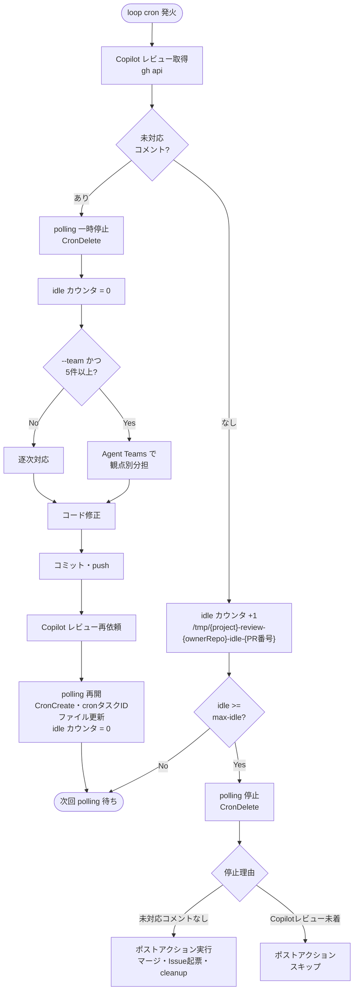
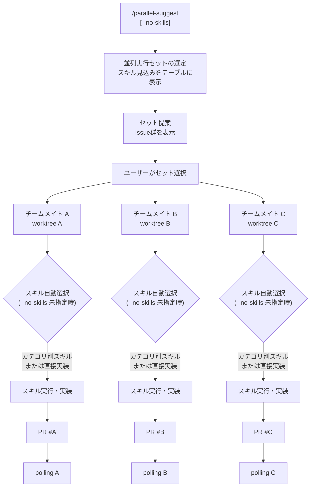
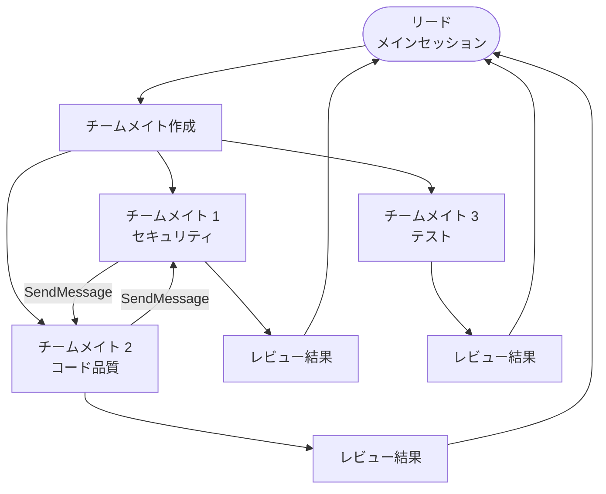
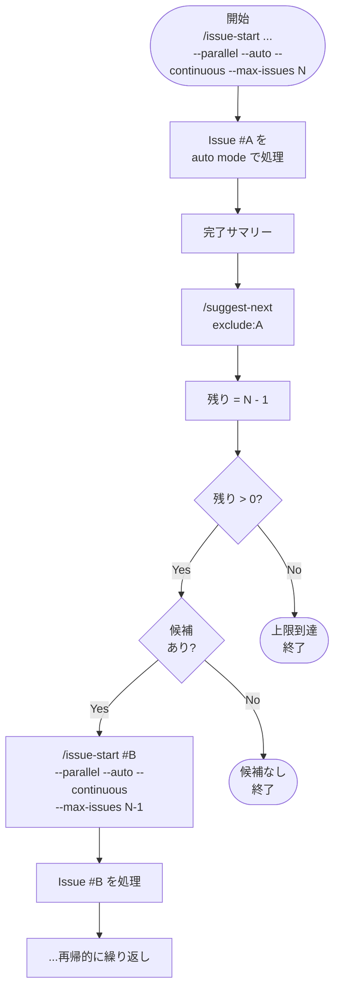
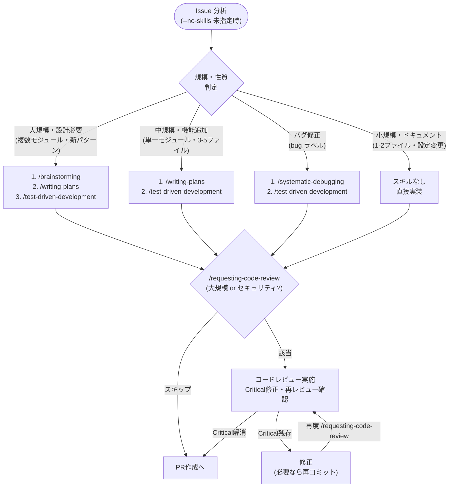
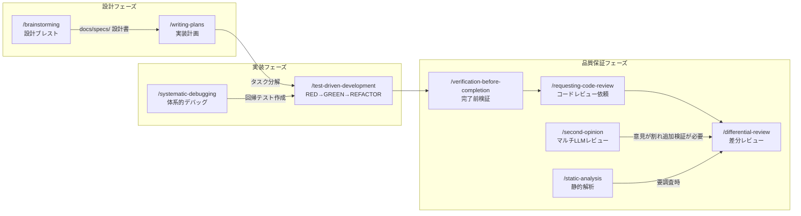
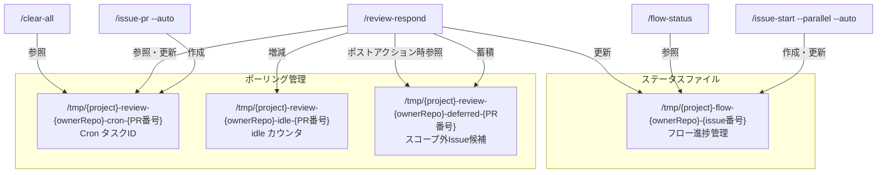

# コマンドオーケストレーション全体フロー図

## 1. コマンド呼び出し関係の全体像

全コマンド/スキル/エージェント間の呼び出し関係を示す。

## 2. メインワークフロー: Issue から マージまで

`/issue-start --parallel --auto` で起動される一気通貫フロー。

## 3. レビュー対応ポーリング詳細

`/review-respond --auto` の内部フローとファイルベース状態管理。

## 4. 並列実行パターン

### 4a. worktree による並列実行

> `/parallel-suggest` は `--no-skills` フラグを受け付ける。未指定時は各チームメイトが担当Issueの規模・性質に応じたスキル自動選択を独立実行する（`.claude/commands/issue-start.md` の「スキルオーケストレーション」セクションに従う）。セット提案のテーブルにはスキル見込み（`適用スキル（見込み）` 列）が表示される。`--no-skills` 指定時はスキル選択・実行およびPR作成前コードレビューを全チームメイトで一律スキップする。

### 4b. Agent Teams による並列実行

## 5. 連続自動実行フロー

`--continuous --max-issues N` によるIssue連続処理。

## 6. スキルのワークフロー連携

設計からテスト駆動開発への接続と、品質保証スキルの適用タイミング。
`/issue-start --auto` のスキルオーケストレーションにより、Issue の規模・性質に応じて自動選択・実行される。

### 6a. スキル自動選択（`/issue-start --auto` 内、`--no-skills` 未指定時）

> `--no-skills` 指定時はこのフロー全体（スキル選択・実行および `/requesting-code-review`）がスキップされ、直接実装 → PR作成に進む。

### 6b. スキル間の連携（手動実行時も含む）

## 7. 状態管理: ファイルベースの協調

各コマンドが使用する一時ファイルとその役割。

## コマンド一覧と用途

| コマンド | 用途 | 主な呼び出し元 |
|---------|------|--------------|
| `/issue-start` | Issue着手（worktree作成・スキルオーケストレーション・実装・PR作成）。`--no-skills` でスキル適用スキップ | `/parallel-suggest`, 手動 |
| `/issue-pr` | PR作成・Copilotレビュー依頼 | `/issue-start --parallel --auto` |
| `/review-respond` | Copilotレビューへの自動対応 | `/loop` (polling) |
| `/loop` | 定期実行スケジューラ | `/issue-pr --auto` |
| `/suggest-next` | 次Issue候補の提案 | `/issue-start` (完了後) |
| `/parallel-suggest` | 並列実行可能なIssueセット提案 | 手動 |
| `/patrol` | プロジェクト巡回・Issue自動提案 | 手動 |
| `/issue-create` | GitHub Issue作成 | `/issue-start`, `/review-respond`, `/patrol` |
| `/commit` | 手動コミット | 手動 |
| `/release` | リリース実行 | 手動 |
| `/flow-status` | 自動フロー進捗表示 | 手動 |
| `/worktree-cleanup` | マージ済みworktree削除 | 手動 |
| `/clear-all` | バックグラウンドタスクのクリーンアップ | 手動 |

| スキル | 用途 | 連携先 |
|-------|------|--------|
| `/brainstorming` | 設計ブレスト | `/writing-plans` |
| `/writing-plans` | 実装計画作成 | `/test-driven-development` |
| `/test-driven-development` | TDDワークフロー | 実装タスク全般 |
| `/systematic-debugging` | 体系的デバッグ | `/test-driven-development` |
| `/differential-review` | PR差分セキュリティレビュー | 手動（セキュリティ変更時） |
| `/requesting-code-review` | サブエージェントコードレビュー | PR作成前 |
| `/second-opinion` | マルチLLMレビュー | セキュリティクリティカルな変更 |
| `/static-analysis` | 静的セキュリティ解析 | CI連携 |
| `/verification-before-completion` | 完了前検証 | 完了宣言前 |

| エージェント | 用途 | 呼び出し元 |
|-------------|------|-----------|
| `gemini-analyzer` | 大規模コードベース解析・Web調査 | `/issue-start` (research / web delegation) |
